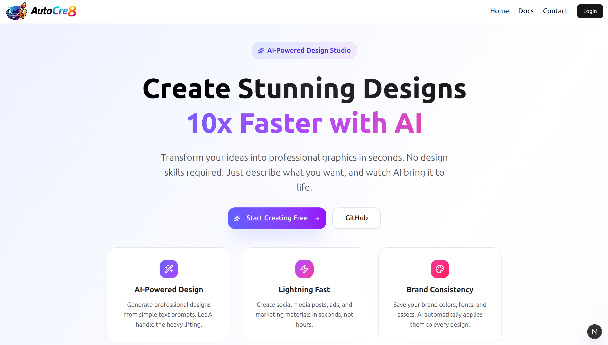
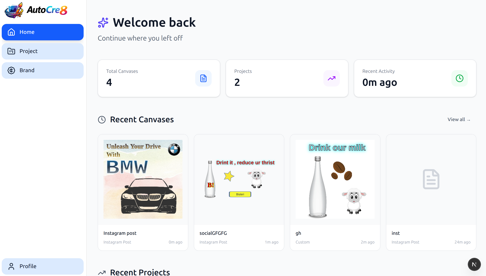
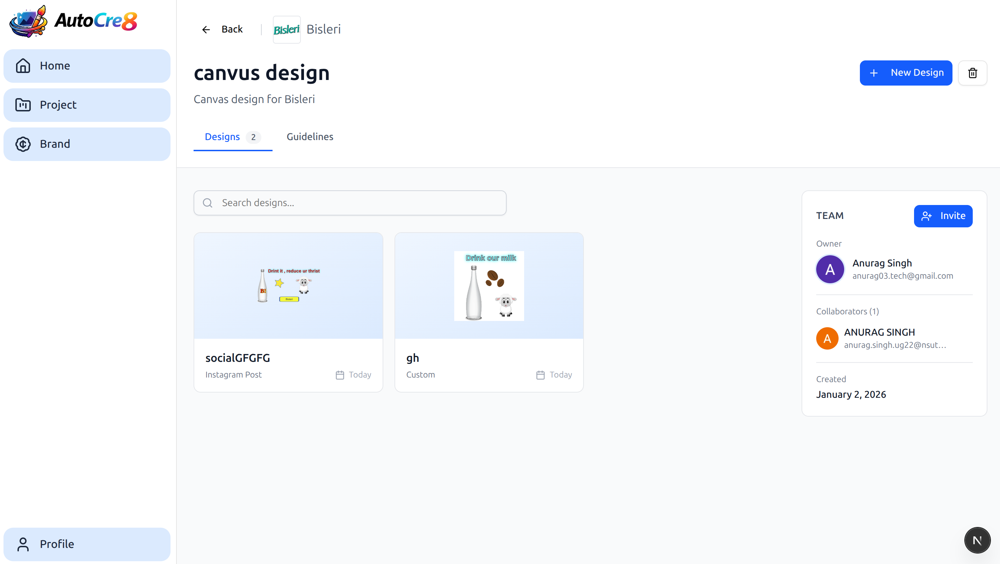
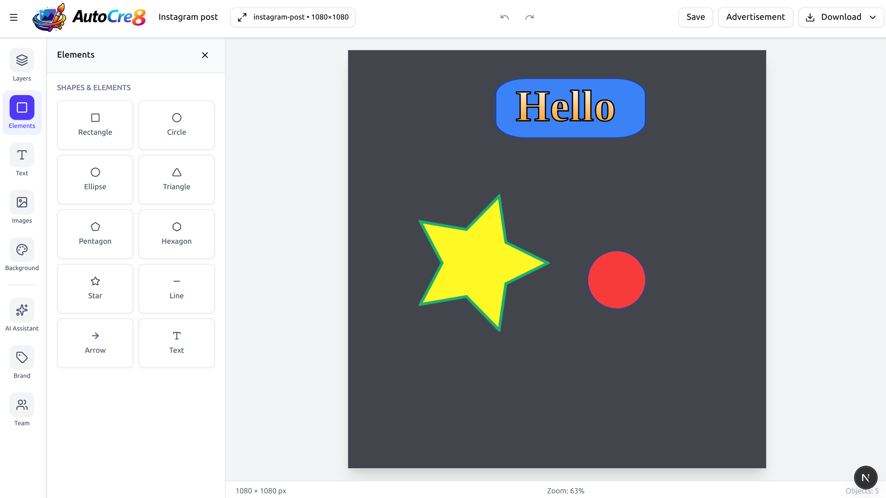
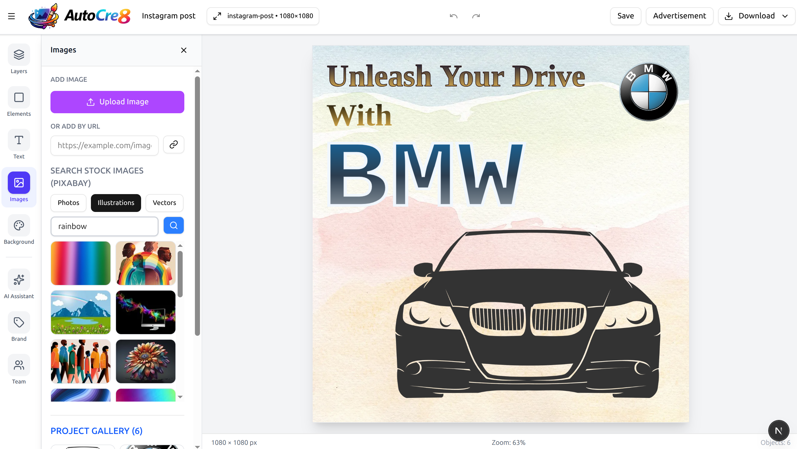
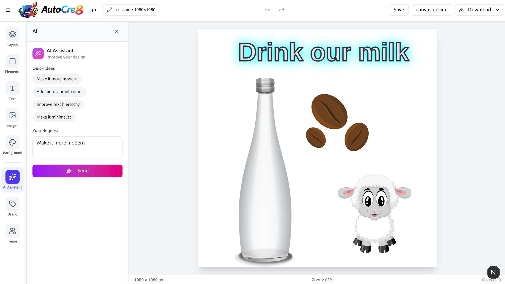
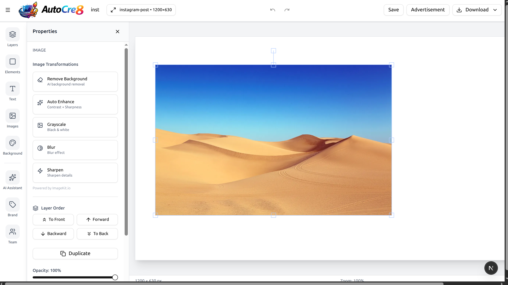
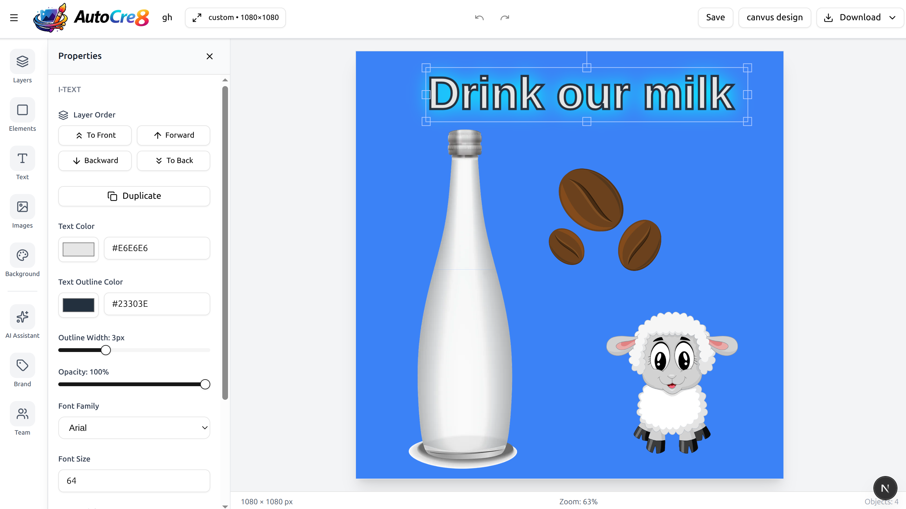

#  AutoCre8 - AI-Powered Design Platform

AutoCre8 is a professional canvas-based design platform with AI-powered design assistance. Create stunning graphics, social media posts, presentations, and more with intelligent layout suggestions and automated design improvements.

## 🚀 Quick Links

|                    🔗 **Live Demo**                    |                                    🎥 **Video Demo**                                     |
| :----------------------------------------------------: | :--------------------------------------------------------------------------------------: |
| [**autocre8.vercel.app**](https://autocre8.vercel.app) | [**Watch Demo**](https://drive.google.com/file/d/1TF4Ux4MLD4rMN88VrpKE7xVGRjODOUSX/view) |

|                                          |                                          |
| :--------------------------------------: | :--------------------------------------: |
|  |  |
|  |  |
|  |  |
|  |  |

## ✨ Features

### 🎯 Core Features

- **AI-Powered Design Assistant** - Create canvas automatically via natural language.
- **One-Click Intelligent Resize** - Adapts designs to different canvas sizes
- **Brand-Aware Design** - Respects brand colors, fonts, and guidelines
- **Image Tranformation** - AI background removal, auto-enhance, Grayscale, blur, sharpen effects
- **Canvas Editor** - Fabric.js-based canvas with precision controls
- **Team Collaboration** - Work on designs with your team
- **Download in PNG/JPEG** - Optimized or original quality

### 🖼️ Design Tools

- **Text Styles** - 12+ gradient and shadow text effects (Fire, Neon, Gold 3D, etc.)
- **Shape Tools** - Rectangles, circles, triangles, polygons with full customization
- **Image Manipulation** - Upload, transform, and apply ImageKit.io filters
- **Advanced Typography** - 15+ fonts with size, weight, and alignment controls
- **Layer Management** - Bring forward/backward, send to front/back
- **Properties Panel** - Fine-tune colors, opacity, borders, shadows

### 🤖 AI Capabilities

- **Smart Layout Planning** - AI analyzes content and creates professional layouts
- **Brand-Aware Design** - Respects brand colors, fonts, and guidelines
- **Intelligent Resize** - Adapts designs to different canvas sizes
- **Content Generation** - Creates headlines, subheadlines, and CTAs
- **Multi-Model AI System** - Powered by OpenAI, Gemini

### 🎨 Image Features

- **ImageKit.io Integration** - Cloud-based image storage and transformations
- **AI Background Removal** - One-click background removal
- **Auto Enhancement** - Automatic contrast and sharpness adjustments
- **Filters** - Grayscale, blur, sharpen effects
- **Aspect Ratio Preservation** - Images maintain proportions

## 🏗️ Architecture

### Tech Stack

#### Frontend (Next.js 16)

```
├── Next.js 16
├── TypeScript
├── Fabric.js 6.0 (Canvas)
├── Tailwind CSS
├── shadcn/ui Components
```

#### Backend (FastAPI)

```
├── FastAPI (Python)
├── LangChain (LLM Integration)
├── Pydantic (Data Validation)
```

#### Services

```
├── MongoDB (Database)
├── ImageKit.io (Image CDN & Transformations)
├── NextAuth.js (Authentication)
```

## 🚀 Getting Started

### Prerequisites

- Node.js 20+
- Python 3.10+
- MongoDB
- API Keys (OpenAI, Gemini, ImageKit, pixabay)

### Installation

#### 1. Clone Repository

```bash
git clone https://github.com/anurag03-tech/AutoCre8-AI-Canvas-Designer
cd AutoCre8-AI-Canvas-Designer
```

#### 2. Setup Frontend

```bash
cd frontend
npm install

# Create .env.local
cp .env.example .env.local
```

**Frontend Environment Variables:**

```env
# MongoDB
MONGODB_URI=mongodb://localhost:27017/autocre8

# Google OAuth
GOOGLE_CLIENT_ID=
GOOGLE_CLIENT_SECRET=

# OpenAI
OPENAI_API_KEY=sk-proj-....

# NextAuth
NEXTAUTH_URL=http://localhost:3000
NEXTAUTH_SECRET=your-super-secret-key-here-generate-it

# FastAPI (ai-service endpoint)
FASTAPI_URL=http://localhost:8000
FASTAPI_API_KEY=autocre8-secret-key-2026

# ImageKit
NEXT_PUBLIC_IMAGEKIT_PUBLIC_KEY=your_public_key
NEXT_PUBLIC_IMAGEKIT_URL_ENDPOINT=https://ik.imagekit.io/your_id
IMAGEKIT_PRIVATE_KEY=your_private_key

# PIXABAY
NEXT_PUBLIC_PIXABAY_KEY=5397604
```

#### 3. Setup AI Service

```bash
cd ai-service
python -m venv venv
source venv/bin/activate  # On Windows: venv\Scripts\activate
pip install -r requirements.txt

```

**AI Service Environment Variables:**

```env

# Create .env

# MongoDB
MONGODB_URI=mongodb+srv://.....
MONGODB_DB_NAME=database_name

# Frontend endpoint
FRONTEND_URL=http://localhost:3000

# OpenAI
OPENAI_API_KEY=sk-...

# Anthropic (Optional - for direct Claude access)
ANTHROPIC_API_KEY=sk-ant-...

# OpenRouter (Optional - Claude fallback)
OPENROUTER_API_KEY=sk-or-...

# Pixabay
PIXABAY_API_KEY=53976040-1c3373e201e4d5f9d23322cce

# ImageKit
IMAGEKIT_PRIVATE_KEY=private_...
IMAGEKIT_PUBLIC_KEY=public_...
IMAGEKIT_URL_ENDPOINT=https://ik.imagekit.io/your_id

# Pixabay
PIXABAY_API_KEY=...
```

### Running the Application

#### Development Mode

**Terminal 1 - Frontend:**

```bash
cd frontend
npm run dev
# Runs on http://localhost:3000
```

**Terminal 2 - AI Service:**

```bash
cd ai-service
source venv/bin/activate
uvicorn app.main:app --reload --port 8000
# Runs on http://localhost:8000
```

### Using AI Assistant

**Example Prompts:**

```
"Create a YouTube thumbnail for our water bottle"
"Make it more modern and minimal"
"Add vibrant colors and improve hierarchy"
"Resize this to Instagram story format"
```
